# Class Diagrams

[<<< back](README.md)

- [What is a UML Class Diagram?](#what-is-a-uml-class-diagram)
- [UML Class Diagram Notation](#uml-class-diagram-notation)
- [Visibility](#visibility)
  - [Public (`+`)](#public-)
  - [Private (`-`)](#private--)
  - [Protected (`#`)](#protected-)
  - [Package (`~`)](#package-)
  - [Derived (`/`)](#derived-)
  - [Static (`_`)](#static-_)
- [Relationships](#relationships)
  - [Association](#association)
  - [Aggregation](#aggregation)
  - [Composition](#composition)
  - [Inheritance (Generalization)](#inheritance-generalization)
  - [Dependency](#dependency)
  - [Realization](#realization)
- [Multiplicity](#multiplicity)
  - [0..1 (Zero or one)](#01-zero-or-one)
  - [0..\* (Zero or many)](#0-zero-or-many)
  - [0..n (Zero to n)](#0n-zero-to-n)
  - [1..1 or 1 (One)](#11-or-1-one)
  - [1..\* (One or many)](#1-one-or-many)
  - [1..n (One to n)](#1n-one-to-n)
  - [n..m (n to m)](#nm-n-to-m)
  - [n](#n)
  - [\* (Many)](#-many)


## What is a UML Class Diagram?

A UML Class Diagram is a type of static structure diagram that is used to describe the structure of a system. It is used to show the classes of a system, their attributes, operations or methods, and the relationships among objects.


## UML Class Diagram Notation

The UML Class Diagram notation is comprised of three main parts:

- Class name: The name of the class is placed in the first partition.
- Attributes: The second partition contains the attributes of the class.
- Operations: The third partition contains the operations that can be performed on the class.

**Example:**

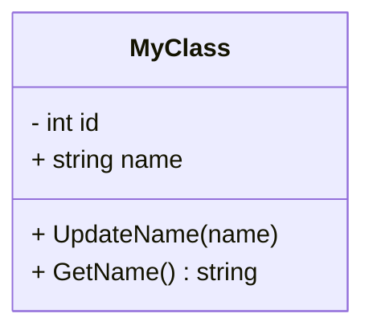

## Visibility

* [`+` Public](#public)
* [`-` Private](#private)
* [`#` Protected](#protected)
* [`~` Package](#package)
* [`/` Derived](#derived)
* [`_` Static](#static)


### Public (`+`)

Public members are accessible from anywhere in the program. They can be accessed by any other class.

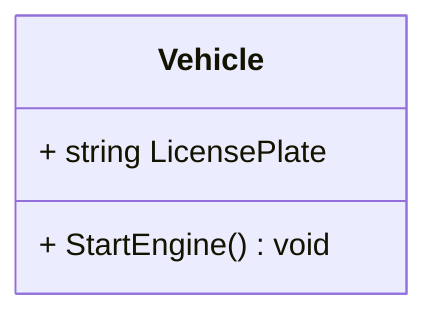

```c#
public class Vehicle {
    public string LicensePlate;

    public void StartEngine() { }
}
```

---

### Private (`-`)

Private members are accessible only from within the class in which they are declared. They cannot be accessed by any other class.

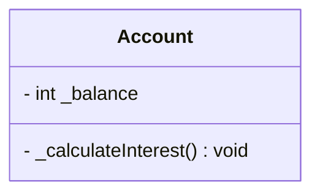

```c#
public class Account {
    private double _balance;

    private void _calculateInterest() {}
}
```

---

### Protected (`#`)

Protected members are accessible from within the class in which they are declared and from within any class derived from the class that declared this member. They cannot be accessed by any other class.

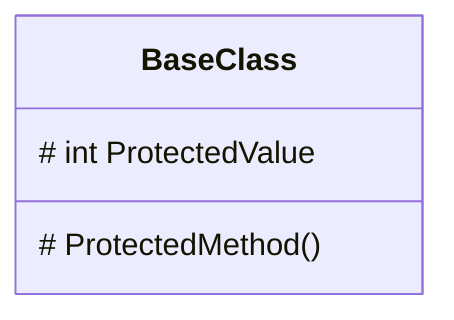

```c#
public class BaseClass {
    protected int ProtectedValue;

    protected void ProtectedMethod() { }
}
```

---

### Package (`~`)

Package members are accessible from within the class in which they are declared and from any other class in the same package. They cannot be accessed by any other class.

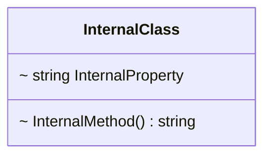

```c#
internal class InternalClass {
    internal string InternalProperty { get; set; }

    internal string InternalMethod() {}
}
```

---

### Derived (`/`)

Derived members are accessible from within the class in which they are declared and from within any class derived from the class that declared this member. They based on the value of other members.

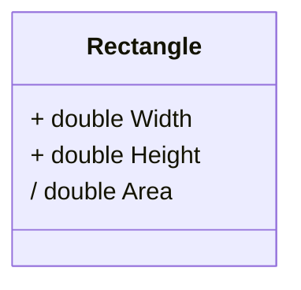

```c#
public class Rectangle {
    public double Width { get; set; }
    public double Height { get; set; }

    public double Area {
        get { return Width * Height; }
    }
}
```

---

### Static (`_`)

Static members has a lifetime that lasts for the entire execution of the program.

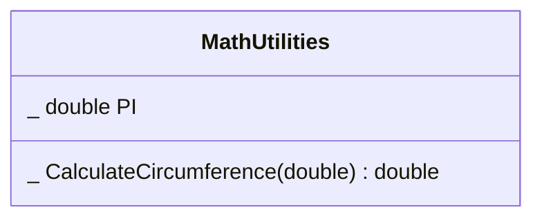

```c#
public class MathUtilities {
    public static double PI = 3.14159;

    public static double CalculateCircumference(double radius) {
        return 2 * PI * radius;
    }
}
```

---


## Relationships

Different types of relationships can be expressed in a UML Class Diagram between classes.

* [Association](#association)
* [Inheritance (Generalization)](#inheritance-generalization)
* [Dependency](#dependency)
* [Aggregation](#aggregation)
* [Composition](#composition)


[Reference](https://mermaid.js.org/syntax/classDiagram.html#defining-relationship)


### Association

Association is a relationship between two classes in which one class is related to the other. It is represented by a solid line. We can say the association is the most generic relationship type and it is the foundation upon which the other relationships are built. Association can be bidirectional or unidirectional, and can be quantified (for example, "one-to-many", "many-to-many").
An example of association is the relationship between a student and a school. A student can attend many schools, and a school can have many students and both can exist without the other.

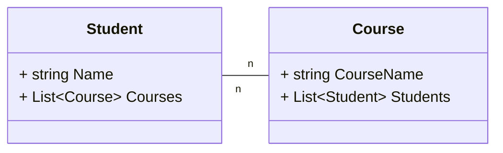

```c#
public class Student {
    public string Name { get; set; }
    public List<Course> Courses { get; set; }
}

public class Course {
    public string CourseName { get; set; }
    public List<Student> Students { get; set; }
}
```

---

### Aggregation

Aggregation is a special type of association that represents a "whole-part" relationship. It is a weak relationship, where the part can exist independently of the whole. For example, a department can have many professors, but the professors do not cease to exist if the department is closed. The aggregation is an especialization of the association.

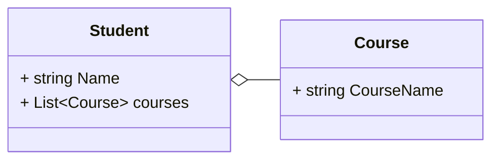

```c#
public class Student {
    public string Name { get; set; }
    public List<Course> Courses { get; set; }
}

public class Course {
    public string CourseName { get; set; }
}
```

---

### Composition

Composition is a stronger form of aggregation. It is a "whole-part" relationship, but in this case the part cannot exist without the whole. If the whole is destroyed, the parts are also. For example, a house and its rooms are a composition. if the house is destroyed, the rooms also cease to exist. The composition is an especialization of the aggregation.

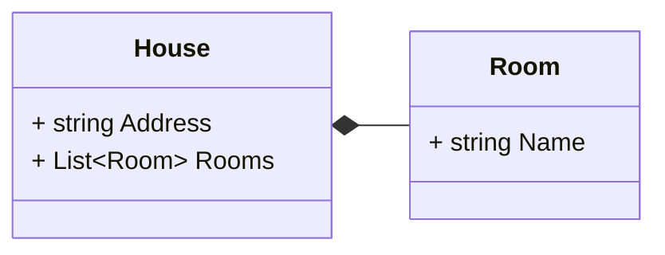

```c#
public class House {
    public string Address { get; set; }
    public List<Room> Rooms { get; set; }
}

public class Room {
    public string Name { get; set; }
}
```

---

### Inheritance (Generalization)

Inheritance or generalization is a relationship where a class (subclass) derives from another class (superclass), inheriting its attributes and operations. This is used to represent "is a" relationships, for example, a cat is a type of animal.

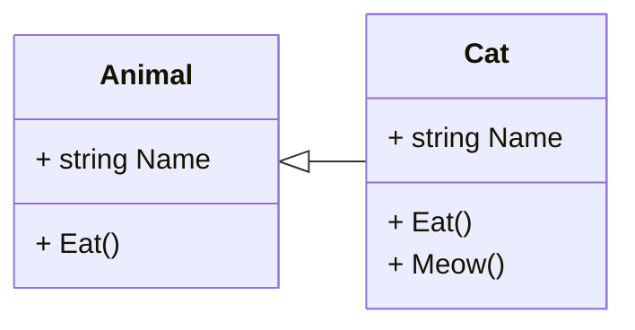

```c#
public class Animal {
    public string Name { get; set; }

    public void Eat() { }
}

public class Cat : Animal {
    public void Meow() { }
}
```

---

### Dependency

Dependency is a relationship where a change in one class (the dependent class) can affect another class (the class it depends on). It is a directional relationship that indicates that a class uses or depends on another class, it is an unidirectional relationship. This type of relationship is most common in high-level design scenarios, especially in system analysis and modeling.

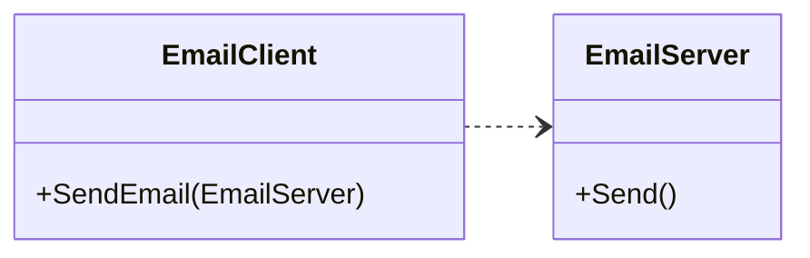

```c#
public class EmailClient {
    public void SendEmail(EmailServer server) {
        server.Send();
    }
}

public class EmailServer {
    public void Send() {}
}
```

---

### Realization

Realization is a relationship where a class implements the interface defined by another class or interface. It is commonly used in situations where a class performs the operations defined in an interface. This type of relationship is really important in object-oriented programming, especially when it comes to abstraction and implementation of specific behaviors.

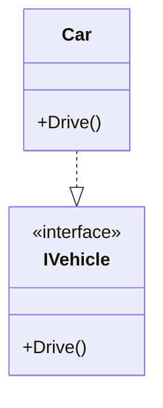

```csharp
public interface IVehicle {
    void Drive();
}

public class Car : IVehicle {
    public void Drive() { }
}
```


---


## Multiplicity

Isn't mandatory to specify the multiplicity of a relationship. When the multiplicity is not specified, it is assumed to be `1..1`.

* `0..1` : Zero or one
* `0..*` : Zero or many
* `0..n` : Zero to n
* `1..1` or `1` : One
* `1..*` : One or many
* `1..n` : One to n
* `n..m` : n to m (n < m). It is a range
* `n` : n
* `*` : Many


### 0..1 (Zero or one)

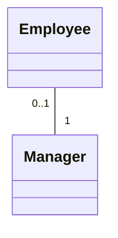

---

### 0..* (Zero or many)

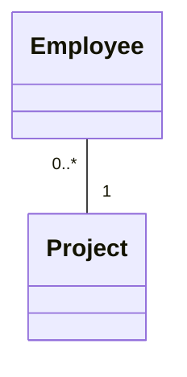

---

### 0..n (Zero to n)

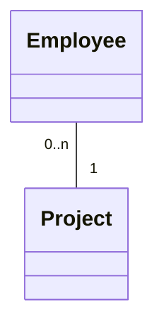

---

### 1..1 or 1 (One)

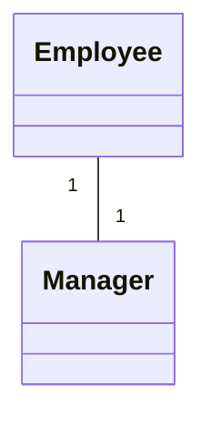

---

### 1..* (One or many)

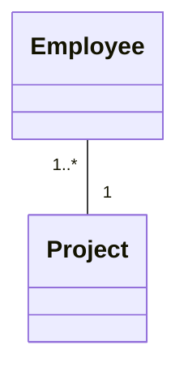

---

### 1..n (One to n)

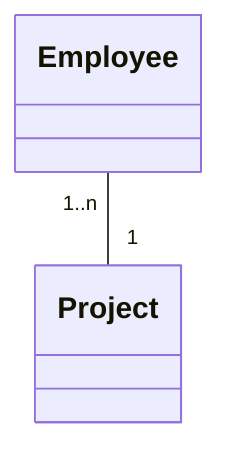

---

### n..m (n to m)

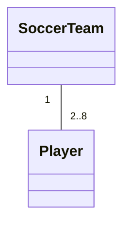

---

### n

```mermaid
classDiagram
    class SoccerTeam
    class Player
    SoccerTeam "1" -- "n" Player
```

---

### * (Many)

```mermaid
classDiagram
    class SoccerTeam
    class Player
    SoccerTeam "1" -- "*" Player
```
